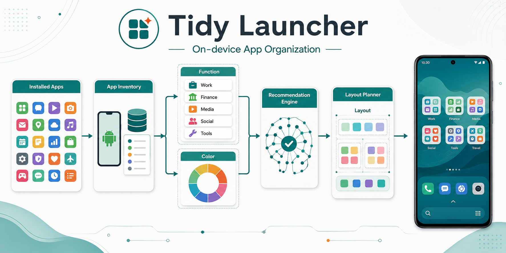
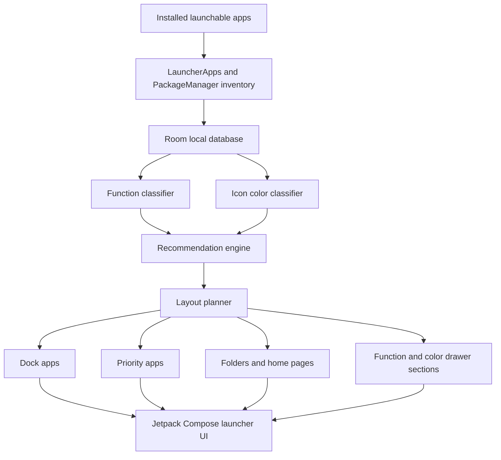

<p align="center">
  
</p>

<h1 align="center">Tidy Launcher</h1>

<p align="center">
  <strong>An Android launcher that automatically organizes installed apps into a cleaner home screen and app drawer.</strong>
</p>

<p align="center">
  <a href="https://github.com/Everyseok/tidy-launcher-android/releases/tag/v1.0.0"></a>
  <a href="https://github.com/Everyseok/tidy-launcher-android/releases/download/v1.0.0/tidy-launcher-debug.apk"></a>
  <a href="https://github.com/Everyseok/tidy-launcher-android/releases/download/v1.0.0/tidy-launcher-release.aab"></a>
  
  
  
  
</p>

Tidy Launcher scans installed apps on-device, classifies them by function and icon color, then generates a structured launcher layout with dock apps, priority apps, folders, and drawer sections.

## What is Tidy Launcher?

**Tidy Launcher** is an Android launcher MVP for people who want a cleaner Home experience without manually dragging every app into place.

It builds a launcher layout from installed-app metadata. The app detects launchable apps, classifies them by function and dominant icon color, recommends an organization mode, and renders a Compose-based launcher with home pages, folders, dock shortcuts, search, and a dual app drawer.

Tidy Launcher works as a launcher only after the user explicitly selects it as the default Android Home app. It does not rearrange or modify OEM launchers in the background.

## Core Features

| Feature | What it does |
|---|---|
| **Full Launcher Mode** | Registers a `HOME` launcher activity so the user can select Tidy Launcher as the default Home app. |
| **On-Device App Inventory** | Uses `LauncherApps` and `PackageManager` to detect installed launchable apps and cache them locally. |
| **Function-Based Classification** | Classifies apps into groups such as work, finance, media, social, travel, tools, games, shopping, health, and utilities. |
| **Color-Based Classification** | Extracts dominant icon colors with AndroidX Palette and maps apps into color groups. |
| **Automatic Layout Planning** | Builds dock apps, priority apps, folders, home pages, and drawer sections from the current app list. |
| **Recommendation Engine** | Recommends function or color sorting and one-page or two-page layouts based on app count, category spread, and wallpaper color context. |
| **Dual App Drawer** | Provides function-based and color-based drawer views with sectioned app grids. |
| **Search & Launch** | Searches installed apps and launches selected apps from the launcher UI. |
| **Onboarding Flow** | Presents recommended settings and requests the Android Home role when available. |
| **Settings UI** | Lets users switch sort mode, switch page mode, rerun organization, and view privacy/premium placeholders. |
| **Package Change Refresh** | Listens for package add, remove, and change broadcasts, then schedules a layout refresh with WorkManager. |
| **On-Device Privacy Model** | Keeps installed-app metadata, classification results, recommendations, and layout decisions on-device. |

## How It Works



Tidy Launcher runs its organization pipeline inside the app. It becomes the active launcher only when Android routes Home to Tidy Launcher after the user selects it as the default Home app.

## Architecture

```text
app/
├── data/
│   ├── AppInventoryProvider
│   └── local database and settings storage
├── domain/
│   ├── classification/
│   │   ├── CategoryClassifier
│   │   └── ColorClassifier
│   ├── layout/
│   │   └── LayoutPlanner
│   ├── RecommendationEngine
│   └── model/
├── platform/
│   ├── PackageChangeReceiver
│   └── RefreshLayoutWorker
├── ui/
│   ├── launcher/
│   ├── onboarding/
│   ├── settings/
│   ├── common/
│   └── theme/
└── billing/
```

The app follows a small domain-driven shape: platform APIs feed app inventory into local storage, classifiers enrich each app, the recommendation engine selects organization preferences, and the layout planner converts those decisions into launcher UI state.

## Tech Stack

| Area | Stack |
|---|---|
| Language | Kotlin |
| UI | Jetpack Compose, Material 3 |
| Presentation | MVVM-style ViewModels |
| App inventory | `LauncherApps`, `PackageManager` |
| Local data | Room |
| Preferences | DataStore Preferences |
| Background refresh | WorkManager |
| Icon color extraction | AndroidX Palette |
| Billing | Google Play Billing placeholder |
| Build system | Gradle Kotlin DSL |
| Minimum SDK | `minSdk 30` |
| Target SDK | `targetSdk 35` |

## Download

| Artifact | Link |
|---|---|
| Latest release | [v1.0.0](https://github.com/Everyseok/tidy-launcher-android/releases/tag/v1.0.0) |
| APK | [tidy-launcher-debug.apk](https://github.com/Everyseok/tidy-launcher-android/releases/download/v1.0.0/tidy-launcher-debug.apk) |
| AAB | [tidy-launcher-release.aab](https://github.com/Everyseok/tidy-launcher-android/releases/download/v1.0.0/tidy-launcher-release.aab) |

## Install on Android

1. Download [tidy-launcher-debug.apk](https://github.com/Everyseok/tidy-launcher-android/releases/download/v1.0.0/tidy-launcher-debug.apk).
2. Open the APK on an Android device running Android 11 or newer.
3. If Android blocks installation, allow installs from the browser or file manager you used to open the file.
4. Launch Tidy Launcher and complete onboarding.
5. Select Tidy Launcher as the default Home app when Android prompts you.

Tidy Launcher will behave as the Home launcher only after that default Home selection is complete.

## Build Locally

```bash
./gradlew clean
./gradlew testDebugUnitTest
./gradlew assembleDebug
./gradlew bundleRelease
```

Helper scripts are available when working with local release and emulator flows:

```text
scripts/build-release.sh
scripts/run-headless-emulator.sh
scripts/install-debug-apk.sh
scripts/capture-emulator-screenshots.sh
scripts/generate-play-assets.py
```

## Current Status

Tidy Launcher is a release-preparation build of an Android launcher MVP. Release artifacts are available on GitHub, but this README intentionally does not describe the app as a fully production-ready launcher.

- [x] Android Home launcher intent filters
- [x] Jetpack Compose launcher UI
- [x] Onboarding flow with Home role request
- [x] Settings screen for sort mode, page mode, and rerun actions
- [x] Installed-app inventory through Android launcher APIs
- [x] Function-based app classification
- [x] Icon color-based classification
- [x] Recommendation engine
- [x] Automatic layout planner
- [x] Dock apps, priority apps, folders, home pages, and drawer sections
- [x] Package change receiver
- [x] WorkManager refresh hook
- [x] APK and AAB release artifacts
- [ ] Production signing and Play Console release flow
- [ ] Deeper real-device UX polish
- [ ] User-customizable pinned apps and folder editing
- [ ] More robust multilingual classification
- [ ] Premium feature finalization

## Roadmap

| Area | Planned direction |
|---|---|
| Layout control | Add editable pinned apps, folder contents, and layout overrides. |
| Personalization | Improve user preferences while keeping automatic organization as the default. |
| Classification | Expand multilingual and region-aware category rules. |
| Launcher polish | Refine transitions, empty states, and daily-use launcher ergonomics. |
| Release readiness | Complete production signing, Play Console preparation, and store policy review. |
| Premium model | Replace placeholder controls with a finalized billing-backed premium flow. |

## Design Principles

| Principle | Intent |
|---|---|
| Organize automatically | Reduce manual icon management by generating a useful first layout. |
| Stay on-device | Keep installed-app metadata, classification, and layout decisions local to the device. |
| Respect Android launcher behavior | Act as a launcher only after explicit user selection as the default Home app. |
| Keep the layout readable | Use dock apps, priority apps, folders, and drawer sections instead of dumping every app onto one screen. |

## Policy Intent

Tidy Launcher is a user-selected launcher replacement. Its package visibility and app inventory behavior are intended to support launcher functionality by finding launchable apps installed on the device.

The app does not modify OEM launchers in the background, does not silently rearrange another launcher, and does not send installed-app metadata off-device as part of the classification or layout pipeline.

## Repository Notes

Current release artifacts are published through GitHub Releases:

```text
tidy-launcher-debug.apk
tidy-launcher-release.aab
```

Common generated local outputs include:

```text
app/build/outputs/apk/debug/app-debug.apk
app/build/outputs/bundle/release/app-release.aab
app/build/reports/tests/testDebugUnitTest/index.html
```

Generated Play Store assets may be located under:

```text
play-store/assets/generated/
```

## Author

**Jun Seok Kim**  
Independent researcher and AI builder  
GitHub: [@Everyseok](https://github.com/Everyseok)  
Homepage: [about-jun-seok-kim.vercel.app](https://about-jun-seok-kim.vercel.app/)
